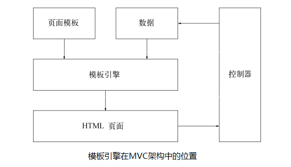

# Node.js基础开发指南实例——Step-0

## 本部分简介
本部分对应书本第五章5.2-5.4节，对原书中部分写法做了新版本的修正。

## 本实例中各工具版本

* node：v0.12.6
* npm：2.11.2
* express：4.13.1
* bootstrap：3.1.1
* ejs：version 2

## 快速开始

### 建立工程
书中建立工程，仅需安装好 `express` 后，执行以下命令：

```
$ express -t ejs microblog
```

新版本的 `express` 还需要安装 `express-generator` 才可快速建立工程，即需要以下命令：

```
$ npm install -g express
```

```
$ npm install -g express-generator
```

```
$ express --ejs node_microblog
```

建立好工程后，需要安装依赖，执行以下命令：

```
$ cd microblog && npm install
```

这样，整个工程就建立好了。  
注意，整个工程的结构有些许变化，启动服务器时，需运行 *bin目录下的www* ，而不是 *app.js* 。

## 路由控制
目前版本express的路由控制，跟书中的有不同，在 `app.js` 中，可以看到路由相关的部分：

```javascript
//app.js
//引入路由的模块
var routes = require('./routes/index');
var users = require('./routes/users');

//middleware
app.use('/', routes);
app.use('/users', users);
```

再来看看 `index.js` 和 `user.js`

```javascript
//index.js
var express = require('express');
var router = express.Router();

/* GET home page. */
router.get('/', function(req, res, next) {
  res.render('index', { title: 'Express' });
});

module.exports = router;
```

```javascript
//user.js
var express = require('express');
var router = express.Router();

/* GET users listing. */
router.get('/', function(req, res, next) {
  res.send('respond with a resource');
});

module.exports = router;
```

对以上改变进行分析：
根据请求路径，调用不同的middleware；所调用的middleware为 `Router` 的一个实例，根据[官网API](http://expressjs.com/4x/api.html#router)，Router实现了middleware的接口，可以直接在app.use中使用，相当于创建了一个 *小的独立的app* 。users.js中的 '/' 实际是建立在 `app.use` 中 '/users' 路径的基础上的，即匹配绝对路径为'/users/'的路径。

为了理解路由的问题，可以做一下尝试：
在app.js中增加：

```javascript
var test = require('./routes/test');
app.use('/test', test);
```

然后在routers文件夹中，新建test.js:

```javascript
var express=require('express');
var router=express.Router();

router.get('/page',function(req,res,next){
     res.send('This is a test page.');
});

module.exports=router;
```

保存后，在浏览器中输入http://localhost:3000/test/page，可以看到：

```html
respond with a resource
```


## 模板引擎
模版引擎是一个从页面模版，根据一定的规则生成HTML的工具。  
在MVC架构中，模版引擎包含在服务器端。控制器得到用户请求后，从模型获取数据，调用模版引擎。模版引擎以数据和页面模版为输入，生成HTML页面，然后返回给控制器，由控制器交回给客户端。

打个比喻：
我需要买一张填好答案的数学试卷（HTML），于是我到了卖试卷的地方。我跟老板（控制器）说：我需要一张有答案的x年第x次月考的数学试卷。老板收到我的请求，于是在电脑里找，找到了一张没有答案的数学试卷（页面模版），然后找到了试卷的答案（模型里的数据），把它们结合在一起（模板引擎），打印在一张白纸上（HTML），再由老板（控制器）交给我。



### 片段视图
书中片段视图部分已经失效。根据目前版本的ejs语法，可以通过嵌套javascript代码实现，现做如下修改：  

1. 删除listitem.ejs
2. 修改list.ejs如下

	```ejs
	<h1><%= title %></h1>
	<ul>
		<% items.forEach(function(item,index,obj){ %>
		<li><%= item %></li>
		<% }); %>
	</ul>
	```

[ejs传送门](https://github.com/mde/ejs)

### 视图助手
书中视图助手部分已经废弃。根据目前版本的express，可通过[app.locals](http://expressjs.com/4x/api.html#app.locals)来实现，现做修改app.js：

```javascript
//app.js
var util = require('util');

//静态助手
app.locals.inspect=function(obj){
  return util.inspect(obj,true);
};

//动态助手
app.use(function(req, res, next) {
  app.locals.headers=req.headers;
  next();
})

app.get('/helper',function(req,res){
  res.render('helper',{title:'Helper'});
});
```

## 小结
本部分主要介绍了如何将原书中建立express工程、路由规则、模板引擎修改为当前版本支持的方法。接下来，会介绍第五章5.5节的修改，详见[step-1](https://github.com/lizijie1993/node_microblog/tree/step-1)。